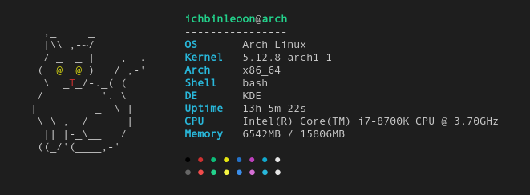

<h1 align="center">chomusuke</h1>

<p align="center">
  <br>
    
  <br>
</p>

<p align="center">A small command-line system information tool for Linux written in Go</p>

<p align="center">
  <a href="https://github.com/IchBinLeoon/chomusuke/releases">
    
  </a>
  <a href="https://github.com/IchBinLeoon/chomusuke/commits/main">
    
  </a>
  <a href="https://github.com/IchBinLeoon/chomusuke/blob/main/LICENSE">
    
  </a>
</p>

## Installation
```
$ go install github.com/IchBinLeoon/chomusuke@latest
```

## Usage
```
$ chomusuke
```

## Contribute
Contributions are welcome! Feel free to open issues or submit pull requests!

## License
MIT © [IchBinLeoon](https://github.com/IchBinLeoon/chomusuke/blob/main/LICENSE)
